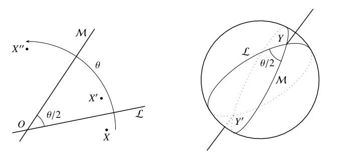
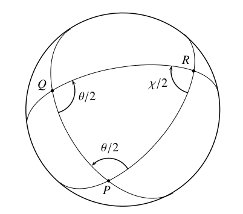

# Grupos continuos

La teoría de los grupos continuos fue creada por el matemático noruego
Sophus Lie en la década de 1870. Inicialmente, su objetivo era
desarrollar una teoría de ecuaciones diferenciales como la teoría de
ecuaciones polinómicas de Galois. Vio que cada ecuación diferencial
tiene un grupo, análogo al grupo de Galois pero "continuo" en lugar de
finito, y que los grupos "simples" presentan un obstáculo para la
solución.\
**Así, su atención se desplazó rápidamente al problema de clasificar
grupos continuos y (particularmente) identificar los grupos simples
entre ellos. La definición de un \"grupo continuo\", o lo que ahora
llamamos un grupo de Lie, es algo sutil, como lo es la definición de
\"simple\" para estos grupos. Aquí nos contentamos simplemente con dar
algunos ejemplos y probar la simplicidad de uno de ellos.**\
El ejemplo más fácil de entender de un grupo continuo es la recta
numérica R, bajo la operación de suma. Este grupo es "continuo" en el
sentido de que la operación de grupo $x , y \to x+y$, y también la
operación inversal de grupo $x \to -x$, es una

función continua. Un ejemplo relacionado es el círculo unitario

$$\mathbb{S}^{1}=\{z : \lvert z\rvert=1\}$$

en el plano de los números complejos, bajo la operación (obviamente
continua) de multiplicación de números complejos. $\mathbb{S}^{1}$
también se llama SO(2), el primero de una familia llamada especiales
ortogonales o de rotación. Podemos interpretar un miembro z de SO(2)
como una rotación del plano, porque
$$z = \cos{\theta}+ i \sin{\theta}\text{, para algun } \theta$$ y
multiplicando cada número complejo por z gira el plano $\mathbb{C}$
alrededor de $O$ a través del ángulo $\theta$. Por lo tanto, la
operación de grupo en $SO(2)$ también puede verse como una suma de
ángulos, que es otra forma de ver que $SO(2)$ es continua. Tanto
$\mathbb{R}$ y $SO(2)$ son grupos abelianos, por lo que no son muy
interesantes. El primer grupo continuo realmente interesante es $SO(3)$,
el grupo de rotación del espacio tridimensional $\mathbb{R}^{3}$. Si
tomamos una rotación $r$ de $\mathbb{R}^{3}$ dada por un eje $A$ que
pasa por $O$ y un giro de ángulo $\theta$ alrededor de $A$, entonces ni
siquiera es obvio que las rotaciones espaciales formen un grupo. Dada
una rotación $r$ con eje $A$ y ángulo $\theta$, y una rotación $s$ con
eje $B$ ángulo $\varpi$, ¿podemos estar seguros de que la combinación
$sr$ tiene incluso un eje $C$ y un ángulo $X$ bien definidos? La (sí)
aparentemente fue encontrada por primera vez por Euler (1776), pero
ahora podemos encontrar esta respuesta mucho más fácilmente. El truco
consiste en ver cada rotación como un producto de dos reflexiones, como
se muestra en la figura 1.

La imagen de la izquierda en la figura muestra un par de líneas en el
plano, $L$ y $M$, que se encuentran en $O$ en el ángulo $\theta/2$. Si
un punto $X$ se refleja en $L$ (hacia $X'$), entonces en $M$ (hacia
$X''$), el ángulo entre $X$ y $X''$ es claramente $\theta$. De manera
más general, está claro que una rotación alrededor de cualquier punto
$Y$ a través del ángulo $\theta$ puede realizarse mediante reflexiones
sucesivas en dos líneas cualesquiera a través de $Y$ que se encuentran
en el ángulo $\theta/2$ (medido en el sentido apropiado). Lo mismo es
cierto para la rotación de una esfera, y por tanto de $\mathbb{R}^{3}$ ,
alrededor de cualquier eje. Para rotar a través del ángulo $\theta$
alrededor del eje $YY'$ (imagen de la derecha) basta con reflejar en dos
grandes círculos cualesquiera a través de $Y$ e $Y'$ que se encuentran
en el ángulo $\theta/2$. De manera equivalente, uno refleja la esfera en
cualquiera de los dos planos que se encuentran a lo largo de la línea
$YY'$ en el ángulo $\theta/2$.

Supongamos ahora que queremos encontrar el resultado de realizar la
rotación $r$ de la esfera, con eje que pasa por $P$ y ángulo $\theta$,
luego la rotación $s$ con eje a través de $Q$ y el ángulo $\varphi$.
Haciendo uso de nuestra libertad para elegir los grandes círculos de
reflexión, realizamos $r$ por el par de reflexiones en los grandes
círculos $L$ y $M$ a través de $P$ que están separados por un ángulo
$\theta/2$, donde $M$ pasa a través de $P$ y $Q$ (Figura 2).)

Luego nos damos cuenta de $s$ por el par de reflexiones en $M$ y $N$ a
través de $Q$ que están separadas por un ángulo $\varphi/2$. De ello se
deduce, dado que las reflexiones sucesivas en $M$ se cancelan, asi

::: center
$sr$ = reflejo en $L$ luego reflejo en $M$ luego reflejo en $M$ luego
reflejo en $N$\
= reflexión en $L$ luego reflexión en $N$\
= rotación alrededor del eje RR a través del ángulo $x$,
:::

donde $R$ es el tercer vértice y $x/2$ es el tercer ángulo, en el
triángulo esférico formado por los grandes círculos $L$, $M$ y $N$. Así,
el producto de las rotaciones es una rotación. Como siempre, esta
operación de "producto" es asociativa, porque es el producto de
funciones. También es claro que la inversa de una rotación es una
rotación (mismo eje, negativo del ángulo), por lo que las rotaciones
forman un grupo bajo la operación producto. Finalmente, es
intuitivamente claro que el producto y el inverso dependen continuamente
de la posición del eje y del ángulo de rotación. Entonces este grupo
$SO(3)$ es continuo. En la siguiente sección veremos que la continuidad
es crucial para demostrar que $SO(3)$ es un grupo simple.

# Simplicidad de $SO(3)$

Para demostrar que $SO$ es simple, consideramos un subgrupo normal
$H \not = {1}$ y pretendemos demostrar que $H = SO(3)$. Como $H$ es
normal, $gH = Hg$, y por lo tanto $gHg^{-1} = H$ para cada $g$ en
$SO(3)$. En otras palabras, $gHg^{-1}$ está en $H$ para cada $g$ en
$SO(3)$ y cada $h$ en $H$. Esto nos permite construir muchos elementos
de $H$ a partir de un elemento no trivial $h$ y, de hecho, podemos
construir todos los elementos de $SO( 3)$. Los construimos en tres
pasos, comenzando con una $h$ específica con eje $A$ y ángulo $\theta$
distinto de cero:

-   H incluye la rotación a través del ángulo $\theta$ sobre cualquier
    eje B.\
    Para ver por qué, sea g una rotación que mueve el eje A al eje B.
    Entonces $gHg^{-1}$ es la rotación a través del ángulo $\theta$
    alrededor del eje $B$ porque

    -   $g^{-1}$ mueve el eje $B$ a la posición del eje $A$.

    -   $h$ gira $\mathbb{R}^{3}$ sobre el eje $A$ a través del ángulo
        $\theta$.

    -   $g$ mueve el eje en la posición $A$ de regreso a su posición
        original $B$.

-   $H$ incluye rotaciones a través de todos los ángulos en un intervalo
    entre algunos $\alpha$ y $\beta$, $\alpha$ \< $\beta$. Como sabemos
    de la sección anterior, el producto de rotación r alrededor del eje
    PP a través del ángulo $\theta$ y una rotación s alrededor del eje
    $QQ'$ a través del ángulo $\theta$ es una rotación alrededor del eje
    $RR'$ a través del ángulo $X$, donde $R$ y $X/2$ son como se muestra
    en Figura 3.

    

    Supongamos ahora que $P$ es fijo y que se permite que $Q$ varíe
    continuamente a lo largo de un gran círculo fijo que pasa por $P$.
    Cuando $Q$ está cerca de $P$, también lo está $R$; por tanto,
    triángulo $PQR$ es casi euclidiano y la suma de sus ángulos es
    cercana a $\pi$. De ello se deduce que $X/2$ está cerca de
    $\pi - \theta$. A medida que $P$ se aleja, el triángulo esférico
    $PQR$ se vuelve más grande, por lo que también lo hace la suma de
    sus ángulos según la Sección 17.6, por lo que $X/2$ se vuelve más
    grande. Dado que $X/2$ varía continuamente con la posición de $Q$,
    necesariamente toma todos los valores en un intervalo entre algún
    $\alpha$ y $\beta$, donde $\alpha < \beta$

-   $H$ incluye rotaciones a través de cualquier ángulo.\
    Como $\alpha < \beta$, el intervalo entre $\alpha$ y $\beta$ incluye
    un subintervalo de la forma $[2m\pi / n, 2(m+1)\pi / n]$, para
    algunos enteros $m$ y $n$. Por tanto, del Paso 2 y el Paso 1 se
    deduce que $H$ incluye todas las rotaciones, alrededor de un eje
    fijo $B$, con ángulos entre $2m\pi / n$ y $2(m+1)\pi /n$. Por
    supuesto, $H$ también incluye todos los productos de sus miembros y,
    por lo tanto, todas sus n-ésimas potencias, que multiplican los
    ángulos por $n$. Pero si multiplicamos los ángulos entre $2m\pi /n$
    y $2(m + 1)\pi /n$ por $n$, obtenemos todos los ángulos, según sea
    necesario.\
    Aplicando el Paso 1 nuevamente, obtenemos rotaciones con todos los
    ángulos y todos los ejes, por lo que $H$ incluye todos los elementos
    de $SO(3)$, como se afirma. Lie observó la simplicidad de muchos
    grupos de Lie, incluido $SO(3)$, pero sus conceptos de 'grupo 'y
    'simplicidad 'eran algo diferentes a los nuestros. En su opinión, un
    'grupo 'incluía 'elementos 'infinitesimales', y los usó para
    determinar la simplicidad. Hoy, llamamos a los 'elementos
    infinitesimales 'de un grupo de Lie sus vectores tangentes en la
    identidad, y construimos a partir de ellos una estructura algebraica
    separada llamada álgebra de Lie del grupo de Lie. Un álgebra de Lie
    tiene una operación de 'producto', llamada paréntesis de Lie, que es
    bastante diferente de una operación de grupo; por ejemplo, el
    corchete de mentira no es asociativo. Sin embargo, es una buena idea
    mirar las álgebras de Lie. Existe un concepto natural de simplicidad
    para las álgebras de Lie, de modo que un grupo de Lie simple tiene
    un álgebra de Lie simple, y probar la simplicidad es algo más fácil
    para las álgebras que para los grupos. La desventaja, si la hay, es
    que un álgebra de Lie simple puede no provenir de un grupo de Lie
    simple.\
    Por ejemplo, el grupo $SU(2)$ del conjunto de ejercicios anterior
    tiene el mismo álgebra de Lie que $SO(3)$, por lo que el álgebra de
    Lie de $SU(2)$ es simple. Sin embargo, el grupo $SU(2)$ no es
    simple; tiene un subgrupo normal con los elementos 1 y -1. El
    problema es que el álgebra de Lie no puede \"detectar\" los
    elementos del grupo que están lejos del elemento de identidad, por
    lo que puede pasar por alto un subgrupo normal cuyos miembros que no
    son de identidad están todos lejos (como es el caso de $SU(2))$.
    Esto no es necesariamente algo malo y, de hecho, muchos autores
    definen un grupo de Lie como simple si su álgebra de Lie es simple.
