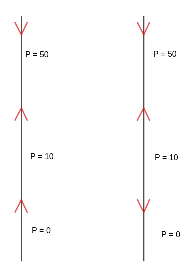
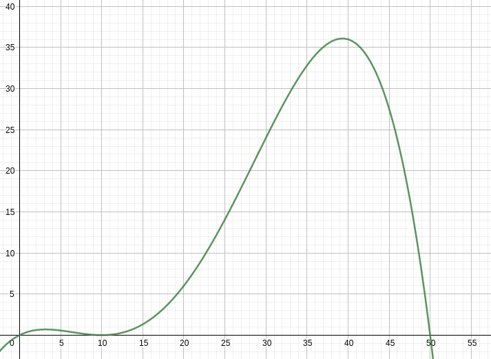
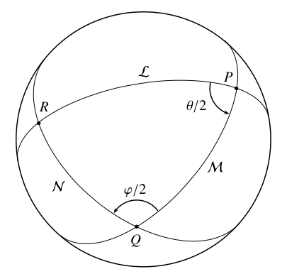

::: center
<figure>

</figure>

------------------------------------------------------------------------

::: center

:::

**Ejercicio Final Introducción Al LaTeX**\

------------------------------------------------------------------------

Autor\
Wilson Eduardo Jerez Hernández\
20181167034\
wejerezh@correo.udistrital.edu.co\
Profesor\
Jhonatan Steven Mora Rodriguez.

Universidad Distrital Francisco José de Caldas\
Facultad de Ciencias y Educación\
Matemáticas\
:::

# La Ecuación de Clase

Antes de hablar de la Ecuacion de clase vamos a demostar el siguiente
teorema.

::: thm
**Teorema 1**. *Sea $G$ un grupo finito y sea $X$ un G-conjunto finito.
si $x  \in X$, entonces $\lvert O_{x}\rvert = [G : G_{x}]$.*

***Demostración.***

*Sabemos que $\lvert G\rvert/\lvert G_{x}\rvert$ es el número de clases
laterales iz1quierdas de $G_{x}$ en $G$ por el Teorema de Lagrange .
Definemos una función biyectiva $\phi$ de la órbita $O_{x}$ de x al
conjunto de clases laterales izquierdas $L_{G_{x}}$ de $G_{x}$ en $G$.
Sea $y \in O_{x}$. ENtonces existye $g$ en $G$ tal que $gx=y$. Definamos
$\phi$ de forma que $\phi(y) = gG_{x}.$ Para mostrar que $\phi$ es
$1-1$, supongamos que $\phi(y_{1}) = \phi(y_{2})$. Entonces
$$\phi(y_{1}) = g_{1}G_{x} = g_{2}G_{x} = \phi(y_{2}),$$ donde
$g_{1}x = y_{1}$ y $g_{2}x = y_{2}$. Como $g_{1}G_{x} = g_{2}G_{x}$,
existe $g \in G_{x}$ tal que $g_{2} = g_{1}g$,
$$y_{2} = g_{2}x = g_{1}gx = g_{1}x = y_{1};$$ por lo tanto. la función
$\phi$ es 1-1. Finalmente, debemos mostrar que $\phi$ es epiyectiva. sea
$gG_{x}$ una clase lateral izquierda. Si $gx=y$, entonces
$\phi(y) = gG_{x}.$ **QED***
:::

Sea $X$ un G- conjunto y $X_{G}$ el conjunto de puntos fijos en $X$; es
decir, $$X_{G} = \{x \in X : gx = x \text{ para todo }  g \in G\}.$$
Como las órbitas de la acción particionan a $X$,
$$\lvert X\rvert = \lvert X_{G}\rvert+ \sum_{i =k}^{n}\lvert O_{x_{i}}\rvert$$
donde $x_{k},\cdots,x_{n}$ son representantes de las distintas órbitas
no triviales de $X$ (aquellas órbitas que contienen más de un elemento).

Ahora consideremos el caso especial en el que G actua en sí mismo por
conjugación, $(g,x) \to gxg^{-1}$. El **centro** de $G$,
$$Z(G) = \{ x : xg = gx \text{ para todo } g \in G\},$$

es el conjunto de puntos que quedan fijos por conjugación. La órbitas de
la acción se llaman **clases de conjugación** de $G$. Si
$x_{1},\cdots,x_{k}$ on representantes de cada una de las clases de
conjugación no-triviales de $G$ y
$\lvert O_{x_{1}}\rvert= n_{1}, \cdots , \lvert O_{x_{k}}\rvert = n_{k}$,
entonces
$$\lvert G\rvert = \lvert Z(G)\rvert + n_{1} + \cdots + n_{k}.$$ Cada
uno de los subgrupos estabilizadores de uno de los $x_{i}$,
$C(x_{i}) = \{g \in G : gx_{i} = x_{i}g\}$, se llama **subgrupo
centralizador** de $x_{i}$. Por el **Teorema 1.1**, obtemos la
**ecuación de clase:**
$$\lvert G\rvert = \lvert Z(G)\rvert + [G:C(x_{1})] + \cdots + [G:C(x_{k}].$$
Una de las conseciuencias de la ecuación de clase es que el orden de
cada clase de conjugación divide al orden de $G$.

# Los teoremas de Sylow

Recordemos Por un momento lo que significa que $G$ actúe en si mismo por
conjugación y cómo las clases de conjugación se distribuyen en el grupo
de acuerdo a la ecuación de clase, discutida anterioremnte. Un grupo $G$
actúa en si mismo por conjugación de manera que $(g,x) \to gxg^{-1}$.
Sean $x_{1}, \cdots , x_{k}$ representantes de cada una de las distintas
clases de conjugación de $G$ que contiene más de un elemnto. Entonces la
ecuación de clase se escribe como
$$\lvert G\rvert = \lvert z(G)\rvert + [G:C(x_{1})] + \cdots + [G: C(x_{k})],$$
donde $Z(G) = \{g \in G : gx = xg \text{ para todo } x \in G\}$ es el
centro de $G$ y $C(x_{i}) = \{ g \in G : gx_{i} = x_{i}g\}$ es el
subgrupo centralizador de $x_{i}$. low examinando los subgrupos de orden
$p$, donde $p$ es un primo. Un grupo de $G$ es un **P-grupo** si todo
elemneto de $G$ tiene orden potencia de $p$, donde $p$ es un número
primo. Un subgrupo de un grupo $G$ es un **P-subgrupo** si es un
p-grupo.

::: thm
**Teorema 2**. *(cauchy) sea $G$ un grupo finito y P un primo tal que p
divide el orden de $G$. Entonces $G$ contiene un elemnto de orden p.*

***Demostración***

*Procederemos por inducción sobre el orden de $G$. si
$\lvert G\rvert=p$, entonces un generados de $G$ es el elemnto
requerido. Supongamos ahora que todo subgrupo de orden $k$, donde
$p \leq k < n$ y $p$ divide a $k$, tiene un elemnto de orden $p$.
supongamos que $\lvert G\rvert = n$ y que $p | n$ y consideremos la
ecuación de clase de $G$:
$$\lvert G\rvert = \lvert z(G)\rvert + [G:C(x_{1})] + \cdots + [G: C(x_{k})]$$
Tenemos dos casos que considerar.*

***Caso 1.** el orden de alguno de los subgrupos centralizadores,
$C(x_{i})$, es divisible por $p$ para algún $i, i = 1, \cdots, k.$ En
este caso, por hipótesis de inducción estamos listos. Como $C(x_{i})$ es
un subgrupo propio de $G$ y $p$ divide a $\lvert C(x_{i})\rvert$,
$C(x_{i})$ contiene un elemnto de orden $p$. Por lo tanto, $G$ contiene
un elemnto de orden $p$.*

***Caso 2.** Ninguno de los centralizadores tiene orden divisible por
$p$. Entonces $p$ divide a $[G:C(x_{i})]$, el orden de cada clase de
conjugación en la ecuación de clase; luego, $p$ divide el orden del
centro de $G$, $Z(G)$. Como $Z(G)$ es abeliano, tiene un subgrupo de
orden $p$ por el Teorema Fundamental de Los Grupos Abelianos Finitos.
Por lo tanto, el centro de $G$ contiene un elemnto de orde $p$.*
:::

::: Corol
**Colorario 3**. *Sea $G$ un grupo finito. Entonces $G$ es un P-grupo si
y solo si $\lvert G\rvert = p^{n}.$*
:::

::: Ej
**Ejemplo 1**. *Consideremos el grupo $A_{5}$. Sabemos que
$\lvert A_{5}\rvert= 60 = 2^{2}\cdot 3 \cdot 5$. por el Teorema de
Cauchy, sabemos que $A_{5}$ tiene subgrupos de órdenes 2,3 y 5. Los
teoremas de sylow nos daán aún más información sobre los posibles
subgrupos de $A_{5}$*
:::

Podemos ahora enunciar el primer Teorma de Sylow. La demostración es muy
similar a la del Teorema de Cauchy.

::: thm
**Teorema 4**. *(primer teorema de Sylow) Sea G un grupo finito y p un
primo tal que $p^{r}$ divide a $\lvert G\rvert$. Entonces G contiene un
subgrupo de orden $p^{r}$ **Demostración** Procederemos por inducción
sobre el orden de $G$ una vez más. Si $\lvert G\rvert=p$ ,entonces
estamos listos. Ahora supongamos que el orden de $G$ es $n$ con $n > p$
y que el teorema es verdadero para todos los grupos de orden menor a
$n$, donde $p$ divide a $n$.Usaremos la ecuación de clase una vez más:
$$\lvert G\rvert= \lvert Z(G)\rvert + [G:C(x_{1})] + \cdots + [G:C(x_{k})].$$
Supongamos primero que $p$ no divide a $[G:C(x_{i})]$ para algún
$i$.Entonces $p^{r}\text{ | }\lVert C(x _{i})\rVert$ , pues $p^{r}$
divide a $\lvert G\rvert = \lvert C(x_{i})\rvert\cdot [G:C(x_{i})]$.
Podemos aplicar la hipótesis de inducción a $C(x_{i})$*

*Por lo tanto, podemos suponer que p divide a $[G:C(x_{i})]$ para todos
los $i$. Como p divide a $\lvert G\rvert$, la ecuación de clase dice que
p divide a $\lvert\lvert Z(G)\rvert\rvert$; luego, por el teorema de
Cauchy,$Z(G)$ tiene un elemento de orden p,digamos g. Sea N el grupo
generado por g. Claramente, $N$ es un subgrupo normal de $Z(G)$ pues
$Z(G)$ es abeliano; por lo tanto,N es normal en G pues todo elemento en
$Z(G)$ conmuta con todo elemento en $G$. Ahora consideremos el grupo
cociente $G/N$ de orden $\lvert G\rvert/p$.Por la hipótesis de
indicción, $G / N$ contiene un subgrupo $H$ de orden $p^{r-1}$.La
preimagen de $H$ bajo el homomorfismo canónico $\phi :G → G / N$ es un
subgrupo de orden $p^{r}$ en $G$.*
:::

# Sea $S_{n}$ el grupo simétrico de n-letras. Demuestre que $A_{n} \trianglelefteq S_{n}$

**Preliminares**\

::: thm
**Teorema 5**. *Sea G un grupo y N un subgrupo de G. Son equivalentes
las siguientes afirmaciones:*

1.  *aN = N a para cada a $\in$ G.*

2.  *Para cada a, b $\in$ G se tiene ab $\in$ N implica ba $\in$ N.*

3.  *$aNa^{-1}$ = {$ana^{-1}$ tal que n $\in$ N} $\subseteq$ N para cada
    a $\in$ G.*

4.  *$aNa^{-1}$ = N para cada a $\in$ G.*
:::

::: thm
**Teorema 6**.

1.  *una permutación par $\circ$ una permutación par es una una
    permutación par*

2.  *una permutación par $\circ$ una permutación impar es una
    permutaciónimpar*

3.  *una permutación impar $\circ$ una permutación par es una
    permutación impar*

4.  *una permutación impar $\circ$ una permutación impar es una
    permutación par*

***Demostración**\
Sabemos que los $\sigma$ son pares o bien impares\
*caso 1*\
sea $\sigma$ una permutación par entonces
$\sigma =( (a_{1}a_{n})(a_{1}a_{n-1} ...(a_{1}a_{3})(a_{1}a_{2}) )$
consideremos pues a
$\sigma^{-1} = ((a_{1}a_{2})^{-1}(a_{1}a_{3})^{-1}...(a_{1}a_{n-1})^{-1}(a_{1}a_{n})^{-1}$
puesto que $(ab)^{-1}= b^{-1}a^{-1}$ pero tambien sabemos que cualquier
transposición es el inverso de si misma por lo tanto
$\sigma^{-1} = ((a_{1}a_{2})(a_{1}a_{3})...(a_{1}a_{n-1})(a_{1}a_{n})$ y
como el número de transposiciones de $\sigma^{-1}$ nunca cambia entonces
$\sigma^{-1}$ es par y sea cualesquiera $\tau \in A_{n}$ por tanto
$\tau$ es par y por lema 2 $\sigma \circ \tau$ es par y
$\sigma \circ \tau \circ \sigma^{-1}$ es par por tanto
$\sigma \circ \tau \circ \sigma^{-1}\subseteq A_{n}$ y por lema 1
$\sigma A_{n} = A_{n} \sigma$ para $\sigma$ par\
**caso 2**\
sea $\sigma$ una permutación impar entonces
$\sigma =( (a_{1}a_{n})(a_{1}a_{n-1} ...(a_{1}a_{3})(a_{1}a_{2}) )$
consideremos pues a
$\sigma^{-1} = ((a_{1}a_{2})^{-1}(a_{1}a_{3})^{-1}...(a_{1}a_{n-1})^{-1}(a_{1}a_{n})^{-1}$
puesto que $(ab)^{-1}= b^{-1}a^{-1}$ pero tambien sabemos que cualquier
transposición es el inverso de si misma por lo tanto
$\sigma^{-1} = ((a_{1}a_{2})(a_{1}a_{3})...(a_{1}a_{n-1})(a_{1}a_{n})$ y
como el número de transposiciones de $\sigma^{-1}$ nunca cambia entonces
$\sigma^{-1}$ es impar y sea cualesquiera $\tau \in A_{n}$ por tanto
$\tau$ es par y por lema 2 $\sigma \circ \tau$ es impar y
$\sigma \circ \tau \circ \sigma^{-1}$ es par por tanto
$\sigma \circ \tau \circ \sigma^{-1}\subseteq A_{n}$ y por lema 1
$\sigma A_{n} = A_{n} \sigma$ para $\sigma$ impar\
por **caso 1** y **caso 2** $\sigma A_{n} = A_{n} \sigma$ para cada
$\sigma \in S_{n}$ $\hfill\square$.*
:::

# Operaciones básicas con matrices

## Suma de matrices

Dadas dos matrices de la misma dimensión, $A=(a_{ij})$ y $B=(b_{ij})$,
se difinen la matriz suma como: $A+B=(a_{ij}+b_{ij})$. Es decir aquella
matriz cuyos elementos se obtienen umando los elementos de las dos
matrices que ocupan la misma misma posición, es decir, $$\begin{pmatrix}
            a_{1} & a_{2}\\
            a_{3} & a_{4}
        \end{pmatrix}
        + 
        \begin{pmatrix}
            b_{1} & b_{2} \\ 
            b_{3} & b_{4}
        \end{pmatrix}
        = 
        \begin{pmatrix}
            a_{1}+b_{1} & a_{2}+b_{2} \\ 
            a_{3}+b_{3} & a_{4}+b_{4}
        \end{pmatrix}$$

## Producto de un número real por una matriz

Dada una matriz $A=(a_{ij})$ y un número real $\lambda$, se define el
producto de un número real por una matriz: a la matriz del mismo orden
que $A$, en la que cada elemento está multiplicado por $\lambda$.
$$\lambda \cdot
        \begin{pmatrix}
            a_{1} & a_{2} \\ 
            a_{3} & a_{4}
        \end{pmatrix}
        =
        \begin{pmatrix}
            \lambda \cdot a_{1} & \lambda \cdot a_{2} \\ 
            \lambda \cdot a_{3} & \lambda \cdot a_{4}
        \end{pmatrix}$$

## Producto de matrices

Dos matrices $A$ y $B$ se dicen multiplicables si el número de columnas
de $A$ coincide con el número de filas de $B$.
$$A_{m\times n} \times B_{n\times p} = M_{m\times p}$$

El elemento $c_{ij}$ de la matriz producto se obtiene multiplicando cada
elemento de la fila $i$ de la matriz $A$ por cada elemento de la columna
$j$ de la matriz $B$ y sumándolos.

# tabla de distribución normal

Para poder utilizar la tabla tenemos que transformar la variable $X$ que
sigue una distribución $N(\mu, \sigma)$ en otra variable $Z$ que siga
una distribución $N(0, 1)$\

    z     0.00     0.01     0.02     0.03     0.04     0.05     0.06     0.07     0.08     0.09
  ----- -------- -------- -------- -------- -------- -------- -------- -------- -------- --------
   0.0   0.5000   0.5040   0.5080   0.5120   0.5160   0.5199   0.5239   0.5279   0.5319   0.5359
   0.1   0.5398   0.5438   0.5478   0.5517   0.5557   0.5596   0.5636   0.5675   0.5714   0.5753
   0.2   0.5793   0.5832   0.5871   0.5910   0.5948   0.5987   0.6026   0.6064   0.6103   0.6141
   0.3   0.6179   0.6217   0.6255   0.6293   0.6331   0.6368   0.6406   0.6443   0.6480   0.6517
   0.4   0.6554   0.6591   0.6628   0.6664   0.6700   0.6736   0.6772   0.6808   0.6844   0.6879
   0.5   0.6915   0.6950   0.6985   0.7019   0.7054   0.7088   0.7123   0.7157   0.7190   0.7224
   0.6   0.7257   0.7291   0.7324   0.7357   0.7389   0.7422   0.7454   0.7486   0.7517   0.7549
   0.7   0.7580   0.7611   0.7642   0.7673   0.7704   0.7734   0.7764   0.7794   0.7823   0.7852
   0.8   0.7881   0.7910   0.7939   0.7967   0.7995   0.8023   0.8051   0.8078   0.8106   0.8133
   0.9   0.8159   0.8186   0.8212   0.8238   0.264    0.8289   0.8315   0.8340   0.8365   0.8389
   1.0   0.8413   0.8438   0.8461   0.8485   0.8508   0.8531   0.8554   0.8577   0.8599   0.8621
   1.1   0.8643   0.8665   0.8686   0.8708   0.8729   0.8749   0.8770   0.8790   0.8810   0.8830
   1.2   0.8849   0.8869   0.8888   0.8907   0.8925   0.8944   0.8962   0.8980   0.8997   0.9015
   1.3   0.9032   0.9049   0.9066   0.9082   0.9099   0.9115   0.9131   0.9147   0.9162   0.9177
   1.4   0.9192   0.9207   0.9222   0.9236   0.9251   0.9265   0.9279   0.9292   0.9306   0.9319
   1.5   0.9332   0.9345   0.9357   0.9370   0.9382   0.9394   0.9406   0.9418   0.9429   0.9441
   1.6   0.9452   0.9463   0.9474   0.9484   0.9495   0.9505   0.9515   0.9525   0.9535   0.9545
   1.7   0.9554   0.9564   0.9573   0.9582   0.9591   0.9599   0.9608   0.9616   0.9625   0.9633
   1.8   0.9641   0.9649   0.9656   0.9664   0.9671   0.9678   0.9686   0.9693   0.9699   0.9706
   1.9   0.9713   0.9719   0.9726   0.9732   0.9738   0.9744   0.9750   0.9756   0.9761   0.9767
   2.0   0.9772   0.9778   0.9783   0.9788   0.9793   0.9798   0.9803   0.9808   0.9812   0.9817
   2.1   0.9821   0.9826   0.9830   0.9834   0.9838   0.9842   0.9846   0.9850   0.9854   0.9857
   2.2   0.9861   0.9864   0.9868   0.9871   0.9875   0.9878   0.9881   0.9884   0.9887   0.9890
   2.3   0.9893   0.9896   0.9898   0.9901   0.9904   0.9906   0.9909   0.9911   0.9913   0.9916
   2.4   0.9918   0.9920   0.9922   0.9925   0.9927   0.9929   0.9931   0.9932   0.9934   0.9936
   2.5   0.9938   0.9940   0.9941   0.9943   0.9945   0.9946   0.9948   0.9949   0.9951   0.9952
   2.6   0.9953   0.9955   0.9956   0.9957   0.9959   0.9960   0.9961   0.9962   0.9963   0.9964
   2.7   0.9965   0.9966   0.9967   0.9968   0.9969   0.9970   0.9971   0.9972   0.9973   0.9974
   2.8   0.9974   0.9975   0.9976   0.9977   0.9977   0.9978   0.9979   0.9979   0.9980   0.9981
   2.9   0.9981   0.9982   0.9982   0.9983   0.9984   0.9984   0.9985   0.9985   0.9986   0.9986
    3    0.9987   0.9987   0.9987   0.9988   0.9988   0.9989   0.9989   0.9989   0.9990   0.9990
   3.1   0.9990   0.9991   0.9991   0.9991   0.9992   0.9992   0.9992   0.9992   0.9993   0.9993
   3.2   0.9993   0.9993   0.9994   0.9994   0.9994   0.9994   0.9994   0.9995   0.9995   0.9995
   3.3   0.9995   0.9995   0.9995   0.9996   0.9996   0.9996   0.9996   0.9996   0.9996   0.9997
   3.4   0.9997   0.9997   0.9997   0.9997   0.9997   0.9997   0.9997   0.9997   0.9997   0.9998
   3.5   0.9998   0.9998   0.9998   0.9998   0.9998   0.9998   0.9998   0.9998   0.9998   0.9998
   3.6   0.9998   0.9998   0.9999   0.9999   0.9999   0.9999   0.9999   0.9999   0.9999   0.9999
   3.7   0.9999   0.9999   0.9999   0.9999   0.9999   0.9999   0.9999   0.9999   0.9999   0.9999
   3.8   0.9999   0.9999   0.9999   0.9999   0.9999   0.9999   0.9999   0.9999   0.9999   0.9999
   3.9   1.0000   1.0000   1.0000   1.0000   1.0000   1.0000   1.0000   1.0000   1.0000   1.0000

# Tabla de probabilidades puntuales de la distribución Binomial (n,p)

$P(X = k) = \binom{n}{k}p^{k}(1-p)^{n-k}$.\

   n   k    0,01     0,05     0,10     0,15     1/6      0,20     0,25     0,30     1/3      0,35     0,40
  --- --- -------- -------- -------- -------- -------- -------- -------- -------- -------- -------- --------
   5   0   0,9510   0,7738   0,5905   0,4437   0,4019   0,3277   0,2373   0,1681   0,1317   0,1160   0,0778
       1   0,0480   0,2036   0,3281   0,3915   0,4019   0,4096   0,3955   0,3602   0,3292   0,3124   0,2592
       2   0,0010   0,0214   0,0729   0,1382   0,1608   0,2048   0,2637   0,3087   0,3292   0,3364   0,3456
       3   0,0000   0,0011   0,0081   0,0244   0,0322   0,0512   0,0879   0,1323   0,1646   0,1811   0,2304
       4   0,0000   0,0000   0,0005   0,0022   0,0032   0,0064   0,0146   0,0284   0,0412   0,0488   0,0768
       5   0,0000   0,0000   0,0000   0,0001   0,0001   0,0003   0,0010   0,0024   0,0041   0,0053   0,0102
   6   0   0,9415   0,7351   0,5314   0,3771   0,3349   0,2621   0,1780   0,1176   0,0878   0,0754   0,0467
       1   0,0571   0,2321   0,3543   0,3993   0,4019   0,3932   0,3560   0,3025   0,2634   0,2437   0,1866
       2   0,0014   0,0305   0,0984   0,1762   0,2009   0,2458   0,2966   0,3241   0,3292   0,3280   0,3110
       3   0,0000   0,0021   0,0146   0,0415   0,0536   0,0819   0,1318   0,1852   0,2195   0,2355   0,2765
       4   0,0000   0,0001   0,0012   0,0055   0,0080   0,0154   0,0330   0,0595   0,0823   0,0951   0,1382
       5   0,0000   0,0000   0,0001   0,0004   0,0006   0,0015   0,0044   0,0102   0,0165   0,0205   0,0369
       6   0,0000   0,0000   0,0000   0,0000   0,0000   0,0001   0,0002   0,0007   0,0014   0,0018   0,0041


# diagramas conmutativos

$$\xymatrix{
A & B \ar[rd] & C & D & E\\
\alpha & \gamma & \beta & \delta
& \epsilon
}$$ $$\xymatrix{
A & B \ar@{.>}[ld] \ar@{--}@(dr,ul)[r]
& C & D \ar@{->>}[d] & E \ar@{<-}[d]
& F \\ \alpha & \beta \ar@/^/[r] \ar@/_/[r]
& \gamma & \delta & \epsilon & \phi
}$$

# cajas

[Este texto está en una caja de color
amarillo]{style="background-color: yellow"}\
[$\sqrt{\frac{x^2}{2}}$]{style="background-color: green"}\
\
\

# MATEMÁTICAS ACTUARIALES

## tabla de mortalidad

+:---------------------------------------------------------------------+
| $l_{x}$: Número de vivos de edad exacta $x$                          |
+----------------------------------------------------------------------+
| $d_{x}$: Número de muertes ocurridas entre las edades $x$ y $x+1$    |
+----------------------------------------------------------------------+
| ${}_nd_{x}$: Número de muertes ocurridas entre las edades $x$ y      |
| $x+n$                                                                |
+----------------------------------------------------------------------+
| $p_{x}$: Probabilidad de que una persona de edad exacta $x$          |
| sobreviva 1 año más                                                  |
+----------------------------------------------------------------------+
| ${}_np_{x}$: Probabilidad de que una persona de edad $x$ sobreviva   |
| $n$ años más                                                         |
+----------------------------------------------------------------------+
| $q_{x}$: Probabilidad de que una persona de edad $x$ muera entre las |
| edades $x$ y $x+1$                                                   |
+----------------------------------------------------------------------+
| ${}_nL_{x}$ Años persona vividos entre las edades                    |
|                                                                      |
| $x$ y $x+n$                                                          |
+----------------------------------------------------------------------+
| $T_x$: Años persona vividos entre las edades $x$ y $w$               |
+----------------------------------------------------------------------+
| $\mathring{e}_x$: Esperanza de vida a la edad $x$                    |
+----------------------------------------------------------------------+

## Anualidades contingentes

  ---------------------------------------------------------
  Dotal puro $n$ años ${}_nE_x$
  Anualidad vitalicia vencida $a_x$
  Anualidad vitalicia anticipada $\ddot{a}_x$
  Anualidad vencida temporal $n$ años $a_{x:n}$
  Anualidad anticipada temporal $n$ años $\ddot{a}_{x:n}$
  ---------------------------------------------------------

# Ejercicio 39 de la sección 1.6 Blanchard

Suponga que desea modelar una población con una ecuación diferencial de
la forma $\frac{dP}{dt}=f(P)$, donde $P(t)$ es la población en el tiempo
$t$.\
Los experimentos han sido realizadas sobre la población que dan la
siguiente información:

-   Los únicos puntos de equilibrio son P = 0, P = 10 y P = 50.

-   Si la población es 100, la población disminuye.

-   Si la población es de 25, la población aumenta.

```{=html}
<!-- -->
```
-   Dibuje las líneas de fase posibles para este sistema para $P>0$ (hay
    dos)

-   Dé un bosquejo aproximado de las funciones correspondientes $f(p)$
    para cada uno de sus lineas de fase.

-   Dé una fórmula para las funciones $f(p)$ cuya gráfica
    concuerde(cualitativamente) con los bosquejos aproximados de la
    parte (b) para cada una de sus líneas de fase.

**Desarrollo**\
**a)**\

::: center

:::

**b) y c)**\
Primera linea de fase

::: center

:::

$f(P)=\frac{1}{10000}P(P-10)^{2}(50-P)$

# Ejercicio 25 de la sección 1.9 Blanchard

Un tanque de 400 galones inicialmente contiene 200 galones de agua que
contienen 2 partes por mil millones en peso de dioxina, un carcinógeno
extremadamente potente. Supongamos que el agua contiene 5 partes por mil
millones de dioxina fluyen hacia la parte superior del tanque a una
velocidad de 4 galones por minuto. El agua del tanque se mantiene bien
mezclada y se extraen 2 galones por minuto del fondo del tanque. ¿Cuánta
dioxina hay en el tanque cuando está lleno?\
$Q(t)$ cantidad de dioxiona en un tiempo t.
$c_{e} = 5 \frac{partes}{mil millones}$\
$v_{e} = 4 \frac{galones}{minuto}$\
$v_{s}=2 \frac{galones}{minuto}$\
$v = v_{o}+(v_{e}-v_{s})t=200+(4-2)t = 200 +2t$\
$c_{s}=\frac{Q_{(t)}}{v} = \frac{Q_{(t)}}{200+2t}$\
entonces, $Q'_{t}+\frac{2}{200+2t}Q=20$\
$Q'_{t}+\frac{1}{100+t}Q=20$\
Como,
$Q(t) =\underbrace{Q_{1}(t)}_{homogenea} +\underbrace{Q_{2}(t)}_{particular}$

## Homogenea

$$\begin{split}
        Q'(t) + \frac{1}{100+t} = 0\\
        Q_{1} (t)=e^{-\int_{t_{0}}^{t}(\frac{1}{100+T}dT)Q_{0}} \\
        = e^{(\ln{(100+t_{0})}-\ln{(100+t)})} \\
        = e^{\ln{(\frac{100+t_{0}}{100+t})}Q_{0}} \\
        = \frac{100+t_{0}}{100+t}Q_{0}
    \end{split}$$

## Particular

$$\begin{split}
        Q'(t)+\frac{1}{100+t}Q=20 \\
        Q_{2}(t)= \frac{100+t_{0}}{100+t}\int_{t_{0}}^{t}\frac{100+T}{100+t_{0}}20dT \\ 
        = \frac{20}{100+t}\int_{t_{0}}^{t}100+TdT \\ 
        = \frac{20}{100+t}(100t-100t_{0}+\frac{t^{2}-t_{0}^{2}}{2})
    \end{split}$$ Ahora, cuando $t_{0}=0$ y $Q_{0}=2$ obtendremios una
solución especifica $$\begin{split}
        Q(t) = \frac{100}{100+t}(2) + \frac{20}{100+t}(100t+\frac{t^{2}}{2})\\
        = \frac{200+2000t+10t^{2}}{100+t}
    \end{split}$$ Entonces\
$$\begin{split}
        v (t) = 200 + 2t \\
        400 = 200 + 2t \\
        200 = 2t \\
        100 = t
    \end{split}$$ $$\begin{split}
        Q_{(100)}=\frac{200+2000(100)+10(100)^{2}}{100+100} \\
        =1501
    \end{split}$$

# Ejercicio sobre la ecuación de Bessel

Sean $x_{1}=x_{1}(t)$ y $x_{2}=x_{2}(t)$ las soluciones de la ecuación
de Bessel

::: center
$2t^{2}x^{''}+tx^{'}+(t^{2}-n^{2})x=0$, $n>0$ constante,
:::

definidas sobre el intervalo $0<t<\infty$, y que satisfacen las
condiciones $x_{1}(1)=1$, $x_{1}^{'}(1)=0$ , $x_{2}(1)=0$,
$x_{2}^{'}=1$, Demuestre que $x_{1}(t)$ y $x_{2}(t)$ forman un conjunto
fundamental de soluciones en $(o, \infty)$.

::: thm
**Teorema 7**. ***Criterio para conjunto fundamental de soluciones**
Sean $x_{1}=x_{1}(t)$ y $x_{2}=x_{2}(t)$ dos soluciones de la ecuacion
diferencial, $t\in J$ entonces los tres condiciones siguientes son
equivalentes.*

1.  *$x_{1}(t)$ y $x_{2}(t)$ forman un conjunto fundamental de
    soluciones*

2.  *$w_{t}=w(x_{1},x_{2}) \not = 0$ para todo $t \in J$*

3.  *$w(t_{0}) \not = 0$ para algún $t_{0}$ en $J$*

***$3 \to 1$**\
Suponga que para dos, constantes $c_{1}$ y $c_{2}$ se tiene:
$$x(t) = c_{1}x_{1}(t) + c_{2}x_{2}(t) = 0, \forall t \in J$$ entonces,
$$x'(t) = c_{1}x'_{t} + c_{2}x'_{2}(t) = 0, \forall t \in J$$ En
particular para $t = t_{0}$,
$$c_{1}x_{1}(t_{0}) + c_{2}x_{2}(t_{0}) = 0$$
$$c_{1}x'(t_{0}) + c_{2}x'_{2}(t_{0}) = 0$$ como $w_(t_{0}) \not = 0$ es
el determinate de la matriz de coeficientes de anterior sistema de
ecuaciones se concluye que $c_{1} = c_{2} = 0$ , lo que prueba la
independencia lineal de $x_{1}$ y $x_{2}$.$\spadesuit$*
:::

## Solución del ejercicio {#solución-del-ejercicio .unnumbered}

Para dar solucionar el ejercicico, vamos a usar del teorema anterior el
númeral (3), y entonces probaremis que $x_{1}(t)$ y $x_{2}(t)$ forman un
conjunto fundamental de soluciones

-   La ecucación de Bessel es homogenea

-   Conjunto solución $(0, \infty)$

-   $t_{0}=1$ y $1 \in (0, \infty)$

-   $w(1) = w(x_{1}(1),x_{2}(1))= det
            \begin{pmatrix}
                x_{1}(1) & x_{2}(1)  \\
                x'_{1}(1) & x'_{2}(1)  \\
            \end{pmatrix} =  x_{1}(1) x'_{2}(1) -  x'_{1}(1) x_{2}(1) = (1 \cdot 1) -(0 \cdot 0) = 1 \not = 0$

$\to x_{1}(t)$ y $x_{2}(t)$ forman un conjunto fundamental de soluciones
en $(0, \infty)$. $\spadesuit$

# Grupos simples finito y campos finitos

Los conceptos sobre grupos simples, los campos finitos y las geometrías
finitas tardaron más de 100 años en desarrollarse.

Se centran en el concepto de grupo lineal que llego a su madurez en el
libro "*Linear Group, with an Exposition of the Galois Field Theory of
Dickson*\" (1910).

Actualmente se define un grupo lineal como un grupo de matrices con
entradas en un campo. Las matrices fueron introducidas por Cayley
(1855). El concepto de campo finito se remonta a Galois. Tomemos el
campo $\mathbb{F}_p = \{0, 1, 2, ..., p-1 \}$, existe el campo
$\mathbb{F}_{p^n}$, para cada número natural $n$, cuyos elementos
polinomios de grado $n-1$ con en $\mathbb{F}_p$.\
**Ejemplo**\

  --------------------------------------------------------------------------
  Consideremos $\mathbb{F}_4 = \mathbb{F}_{2^2} = \{0, 1, x, x+1 \}$
  bajo la adición y multiplicación mod $2$. Note que, el campo
  $\mathbb{F}_4 = \mathbb{F}_{2^2}$ se construye:
  $\mathbb{F}_4 = \mathbb{F}_2\left[x \right] / \left<x^2 + x + 1 \right>$
  --------------------------------------------------------------------------

\
Se deduce que hay campos con $4$, $8$ y $9$ elementos porque $4=2^2$,
$8=2^3$ y $9=3^2$.

Las transformaciones de las lineas proyectivas sobre campos nos dan un
nuevo grupo simple

-   $PSL(2, 4) = PGL(2, 4)$ tiene $5\cdot 4\cdot 3 = 60$ elementos, y
    resulta que es isomorfo a $A_5$.

-   $PSL(2, 9)$ tiene $10 \cdot 9 \cdot 8/2 = 360$ elementos, y resulta
    ser isomorfo a $A_6$.

-   $PSL(2, 8) = PGL(2, 8)$ tiene $9 \cdot 8 \cdot 7 = 504$ elementos, y
    es un nuevo grupo simple, descubierto por Cole (1893).

Moore demostro:

-   Todo campo finito es isomorfo a uno de los campos de Galois
    $\mathbb{F}_{p^n}$.

-   Todos los grupos $PSL(2,np)$ son simples cuando $p>3$ y $n>1$.

Rescribiendola,\

  "Todos los grupos $PSL(2,p^n)$ son simples cuando $p^n>3$.\"
  --------------------------------------------------------------

\
De forma general,\

  "$PSL(m,q)$ es simple para todo $m,q\geq 2$ excepto $(m,q) = (2,2), (2,3)$.\"
  -------------------------------------------------------------------------------

\
En conclusión,

::: Def
**Definición 1**. *$PSL(m,q)$ es el grupo de matrices $m\times m$ con
entradas en $\mathbb{F}_q$ y determinante $1$ cocientado por el subgrupo
formado por la matriz identidad y su negativo.*
:::

La geometría se puso al día en 1905 cuando Veblen definió el espacio
proyectivo $m-$dimensional sobre el campo $\mathbb{F}_q$.

Se descubrió que grupos como el "grupo de rotación de $\mathbb{R}^n$\"
tienen homólogos finitos que suelen ser grupos simples.

En 1860, surgieron cinco grupos simples finitos de la nada. Estos grupos
se conocen como los grupos de Mathieu, en honor a su descubridor "Emile
Mathieu\".

# Los grupos de Mathieu

Un grupo se llama grupo $k-$transitivo, si existe un conjunto de
elementos sobre los que el grupo actúa fiel (monomorfismo) y
$k-$transitivamente.

Si los elementos de G permutan un cierto conjunto S, entonces

-   $G$ se llama $1-$transitivo si cualquier miembro de $S$ puede ser
    enviado a cualquier otro miembro de $S$ mediante una permutación en
    $G$.

-   $G$ se llama $2-$transitivo si cualquier par ordenado de miembros de
    $S$ puede ser a cualquier otro par ordenado de miembros de $S$ por
    un miembro de $G$.

::: Def
**Definición 2**. *El grupo $G$ actúa sobre el conjunto $S$ si
$$\begin{split}
    \psi:G\times S &\longrightarrow S\\
       (g,x) &\longmapsto g\cdot x
\end{split}$$*

-   *$\psi(e,x) = e\cdot x = x$ para todo $x\in S$.*

-   *$\psi(g_2,\psi(g_1,x)) = \psi(g_2,g_1\cdot x) = (g_2g_1)\cdot x = \psi(g_2g_1, x)$*
:::

::: Ej
**Ejemplo 2**. *El grupo alterno $A_n$ es $k-$transitivo para números
impares $k\leq n$.*
:::

-   Mathieu descubrió (1861, 1873) cuatro grupos de permutación que son
    4 o 5-transitivos, y un grupo relacionado que es 3-transitivo.

-   Los cincos grupos de Mathieu se denominan $M_{11}$, $M_{12}$,
    $M_{22}$, $M_{23}$ y $M_{24}$.

        Grupo     Transitividad  Orden
      ---------- --------------- ---------------------------------------------------------------------------------------------------------------------------------------------------------------
       $M_{11}$         4        11$\cdot$`<!-- -->`{=html}10$\cdot$`<!-- -->`{=html}9$\cdot$`<!-- -->`{=html}8
       $M_{12}$         5        12$\cdot$`<!-- -->`{=html}11$\cdot$`<!-- -->`{=html}10$\cdot$`<!-- -->`{=html}9$\cdot$`<!-- -->`{=html}8
       $M_{22}$         3        22$\cdot$`<!-- -->`{=html}21$\cdot$`<!-- -->`{=html}20$\cdot$`<!-- -->`{=html}16$\cdot$`<!-- -->`{=html}3
       $M_{23}$         4        23$\cdot$`<!-- -->`{=html}22$\cdot$`<!-- -->`{=html}21$\cdot$`<!-- -->`{=html}20$\cdot$`<!-- -->`{=html}16$\cdot$`<!-- -->`{=html}3
       $M_{24}$         5        24$\cdot$`<!-- -->`{=html}23$\cdot$`<!-- -->`{=html}22$\cdot$`<!-- -->`{=html}21$\cdot$`<!-- -->`{=html}20$\cdot$`<!-- -->`{=html}16$\cdot$`<!-- -->`{=html}3

?'Cuál es la mejor manera de codificar los mensajes para que los errores
puedan ser detectados y corregidos?

Un mensaje se divide en "caracteres\", que son secuencias de 0s y 1s
(secuencias binarias) de una determinada longitud fija k.

El objetivo de la teoría de la codificación es conseguir la máxima
corrección de errores con el mínimo aumento de la longitud del mensaje.

::: Ej
**Ejemplo 3**. *Para $d = 3$ y $k = 7$ es la longitud mínima que se
puede utilizar para obtener 16 caracteres, y esto se consigue con el
siguiente código: $$\begin{matrix}
0000000 & 0100101 & 1000110 & 1100011 \\
0001111 & 0101010 & 1001001 & 1101100 \\
0010011 & 0110110 & 1010101 & 1110000 \\
0011101 & 0111001 & 1011010 & 1111111 \\
\end{matrix}$$*
:::

Este código se debe a Hamming (1950), y se conoce como *código Hamming*
$(7, 4)$. Un código más notable es el código $(23, 12)$ de Golay (1949).
El *código de Golay* consiste en $2^{12} = 4096$ secuencias binarias de
longitud $23$, dos de las cuales difieren en al menos siete dígitos
(tres dígitos erróneos).

-   Las simetrías del código pueden realizarse mediante un grupo de
    transformaciones lineales del espacio $\mathbb{F}_{2^{32}}$, y este
    grupo de simetría resulta ser nada menos que $M_{23}$.

-   El grupo $M_{24}$ aparece cerca, como el grupo de simetría de un
    subconjunto relacionado de $\mathbb{F}_{2^{24}}$, el llamado *código
    de Golay extendido*.

-   Estos descubrimientos se deben a Paige (1957) y Assmus y Mattson
    (1966).

# Grupos continuos

La teoría de los grupos continuos fue creada por el matemático noruego
Sophus Lie en la década de 1870. Inicialmente, su objetivo era
desarrollar una teoría de ecuaciones diferenciales como la teoría de
ecuaciones polinómicas de Galois. Vio que cada ecuación diferencial
tiene un grupo, análogo al grupo de Galois pero "continuo" en lugar de
finito, y que los grupos "simples" presentan un obstáculo para la
solución.\
El ejemplo más fácil de entender de un grupo continuo es la recta
numérica R, bajo la operación de suma. Este grupo es "continuo" en el
sentido de que la operación de grupo $x , t \to x+y$, y también la
operación inversal de grupo $x \to -x$, es una

función continua. Un ejemplo relacionado es el círculo unitario
$$\mathbb{S}^{1}=\{z : |z|=1\}$$ Podemos interpretar un miembro z de
SO(2) como una rotación del plano, porque
$$z = \cos{\theta}+ i \sin{\theta}\text{, para algun } \theta$$ El
primer grupo continuo realmente interesante es $SO(3)$, el grupo de
rotación del espacio tridimensional $\mathbb{R}^{3}$. Si tomamos una
rotación $r$ de $\mathbb{R}^{3}$ dada por un eje $A$ que pasa por $O$ y
un giro de ángulo $\theta$ alrededor de $A$, entonces ni siquiera es
obvio que las rotaciones espaciales formen un grupo. Dada una rotación
$r$ con eje $A$ y ángulo $\theta$, y una rotación $s$ con eje $B$ ángulo
$\varpi$, ¿podemos estar seguros de que la combinación $sr$ tiene
incluso un eje $C$ y un ángulo $X$ bien definidos? La respuesta es (sí)
aparentemente fue encontrada por primera vez por Euler (1776), pero
ahora podemos encontrar esta respuesta mucho más fácilmente. El truco
consiste en ver cada rotación como un producto de dos reflexiones, como
se muestra en la siguiente figura.


Supongamos ahora que queremos encontrar el resultado de realizar la
rotación $r$ de la esfera, con eje que pasa por $P$ y ángulo $\theta$,
luego la rotación $s$ con eje a través de $Q$ y el ángulo $\varphi$.
Haciendo uso de nuestra libertad para elegir los grandes círculos de
reflexión, realizamos $r$ por el par de reflexiones en los grandes
círculos $L$ y $M$ a través de $P$ que están separados por un ángulo
$\theta/2$, donde $M$ pasa a través de $P$ y $Q$.



::: thebibliography
X [Thomas W. Judson]{.smallcaps} *Algebra Abstracta : Teoría y
Aplicaciones*\
<http://abstract.ups.edu/aata-es/section-sylow-theorems.html> [Tablas de
probabilidad]{.smallcaps}\
<https://www.uv.es/montes/nau_gran/tablas.pdf>\
<https://www.superprof.es/apuntes/escolar/matematicas/probabilidades/distribucion-normal/tabla-de-la-distribucion-normal.html>
[Operaciopnes con matrices]{.smallcaps}\
<https://www.superprof.es/apuntes/escolar/matematicas/algebralineal/matrices/operaciones-con-matrices.html>
[Misraim Guitiérrez]{.smallcaps} *Introducción al LaTeX*\
<https://sistemas.fciencias.unam.mx/~misraim/notas.pdf> [Dept.
d'informática, universitat de valéncia]{.smallcaps} *LaTeXavanzado
pauqetes y herramientas para gráficos*
:::
